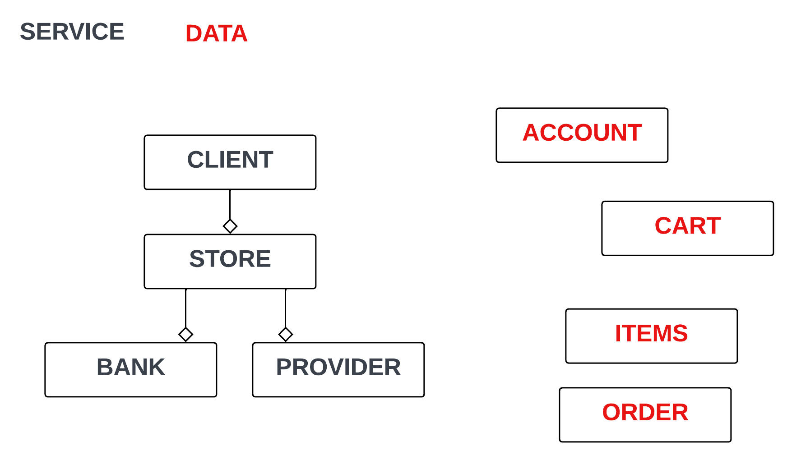

# estore

Projet pour l'enseignement des composants logiciels

---
## Mathis

#### Couplage et dépendances
4 objtes service : Bank, Client, Provider, Store  
4 objets Data : Account, Cart, ItemInStock, Order   
<u>Raisonnement : </u>  
Client : car init **Store** dedans (on init pas un service dans une data)  
Et en meme temps getter setter de Client dans Cart ?? :/   
Store : car init **Bank** et **Provider** dedans  
Bank : Pas sur , globalement seulement setter mais nom de fct laisse croire que c'est un service   
Provider : fct "order"  

#### Services offerts - 1
#### Services offerts - 2
#### Services offerts - 3
#### Services requis
#### Bilan - 1
#### Bilan - 2
#### Bilan - 3
#### Bilan - 4
#### Bilan - 5
#### Bilan - 6
#### Bilan - 7
#### Bilan - 8
#### Bilan - 9

---